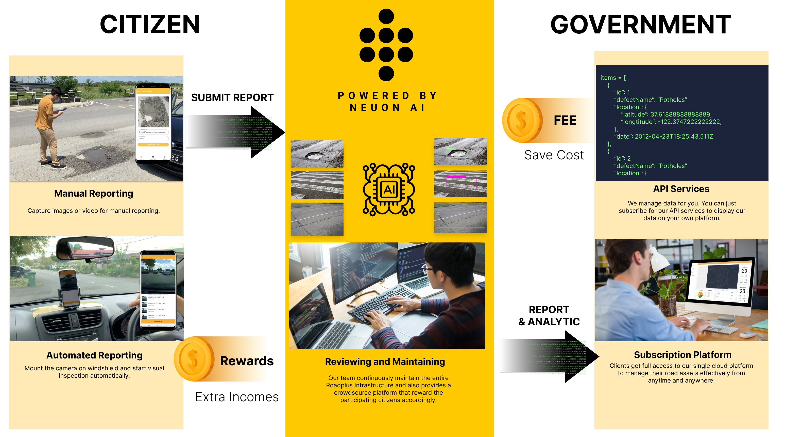

# RoadPlus

RoadPlus is our solution / submission to [MyHackathon 2020 (_Bina Negara_)](https://myhackathon.com.my/). The _Bina Negara_ theme focuses on the enhancement of our nation's infrastructure development programmes which aims to:
- improve govt-2-citizen business processes
- deploy efficient business models and cost management
- gather accurate data for planning

#### Chosen problem statement: _Bina 1_
A digital solution for citizen reporting on the maintenance of roads, highways and government building or structures.

#### Context background
An important role of the Ministry of Works (MOW) is the maintenance of road and highway infrastructure, government buildings (such as schools, hospitals, clinics, quarters) and structures (such as bridges, flyovers, tunnels and drains). The number and types of assets that are under the ministry are large, geographical dispersed and varied. An effective and timely reporting platform can contribute to improve the maintenance of these public assets.

## Summary
We aim to provide (1) an automated road inspection solution, (2) a simple reporting platform for citizens (3) a cost effective solution. We apply RoadPlus AI in the smartphone to inspect road damages automatically. The reporting steps are extremely simple which requires only to mount the user's smartphone on the car windshield and only one button to start reporting and upload to the cloud. The government can access the report at our single cloud-based platform on an on-demand basis. No expensive hardware or in-house technical team is required.

## About RoadPlus
We aim to create a simplified, automated, low-resource technology and timely reporting platform that enables the joint contribution between the citizens and the government towards a better maintenance of roads and highways.

Our solution focuses on the reporting of damaged roads / highways by the citizens using RoadPlus app. It is simple and user-friendly where the users may choose between the two modes of reporting which are manual and automated (auto). 

In manual reporting, the users can upload images or videos to report in RoadPlus App. On the other hand, auto reporting only requries the user to mount their smartphones on the windshield or dashboard of their car and start recording. In both reporting modes, additional information such as the date, time, Global Positioning System (GPS) location of the roads will be automatically attached before sending to the cloud-based platform.

We propose an incentive scheme to encourage the citizens to proactively use RoadPlus and contribute towards maintaining the road network, particularly in their neighbourhood. A point-based scheme can be formulated, e.g. the citizens can accumulate points based on the number of kilometres of roads they have reported, and use the points as rebates for road tax payments or other government utility bills.

With this joint contribution, the government or any related stakeholders can monitor and manage their road network digitally via our RoadPlus cloud-based platform which allows the timely and efficient monitoring and management of road assets from any computer anytime, anywhere.

## Overview of RoadPlus

   
  How the solution works

## Road Infrastructure
3 main modules:
  - RoadPlus AI core
  - RoadPlus reporting mobile application
  - RoadPlus cloud-based platform

## Features
  **1. Citizen report and communicate channel**
   - 2 methods of reporting:
     - manual: users can manually upload images or videos and the location of the damaged road 
     - automated: users can mount their smartphones on their car windshield or dashboard to allow the automated AI capturing of road damage
   - update action taken and give feedback to the citizens regarding their reports
   - share news and announcements to the citizens regarding related road information
    
  **2. Road surface detection**
   - road damage detection and indexing
   - automate road damage classification and geo-location (Global Positioning System, GPS) identification

  **3. Raw roughness analysis**
   - Collect raw smartphone sensor data (accelerometer) and convert it to the International Roughness Index (IRI).
   - Measure of a road's roughness starting at 0 and increasing as roughness increases.
   - Import the data in bulk from other sources such as road profilers.
    
  **4. Cloud-based dashboard**
   - Visualisation of the inspection
   - Action and management
   - Report generation and summary
  
  **5. Online or offline working environment**
   - RoadPlus App works perfectly in offline mode without relying on internet connection
   - Allow users to upload data when internet connection is available

## Keys Benefits to Stakeholders:

- **Government and related stakeholders:**
  - Fast and effective way to access insightful data
  - Lower cost on developing and managing a reporting platform
  - Leverage on state-of-the-art, reliable and economical AI and digital technologies 
  - Save cost without having to invest in expensive equipment and human capital

- **Citizen**:
  - Earn incentives as an extra income source while reporting any road damages, erosion and road hazards
  - Report and manage all issues under one RoadPlus app
  - Do not have to worry where, how and who to report to with respect to road damages and maintenance
  - Enjoy traceable and transparent solutions to monitor the work process of road maintenance companies and government
  - Access to all recent news / notification / information about roads and highways

## RoadPlus Web and Mobile App Demo / Download Links
- [Pitch deck](https://github.com/NeuonAI/roadplus/blob/main/Roadplus%20Pitching%20Deck.pdf)
- [Demo video](https://www.youtube.com/watch?v=ndAlAmZwaR4&feature=youtu.be)

### Web App Login Credentials
The web demo contains mostly administrative role which is not suitable to disclose to public. For the login credentials please contact any of the following persons:
- **Dr. Chai K.C.**
    kc@neuon.ai
    +60 14-688 4403
    +60 82-361 556

- **Chang Yang Loong**
    yangloong@live.com.my
    +60 16-897 6204

We apologise for any inconvenience caused and hope for your understanding. Thank you.

 
 

### For more info you may visit us at: https://neuon.ai/
